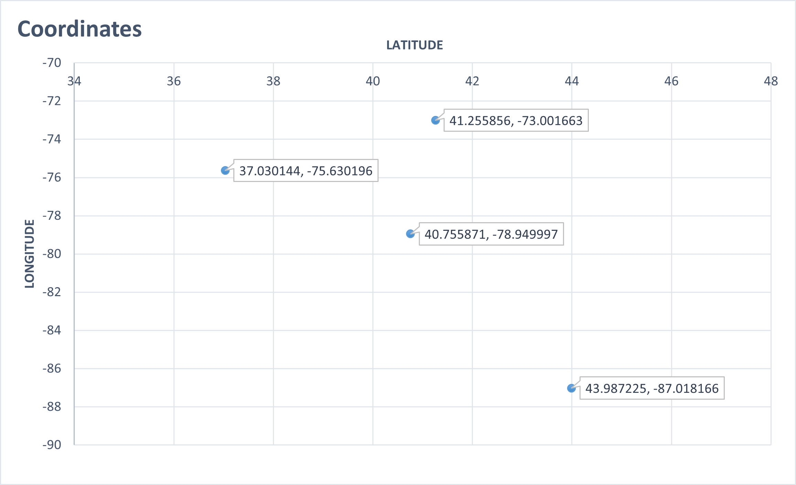
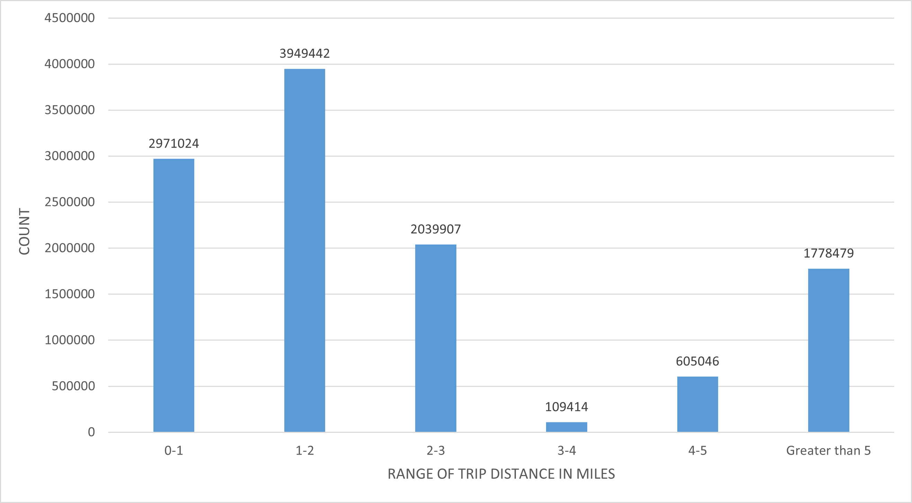
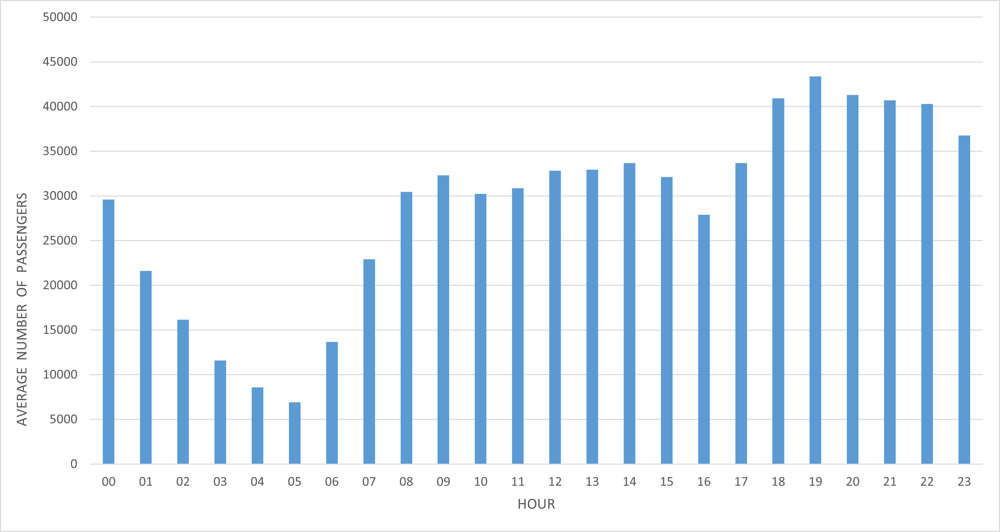
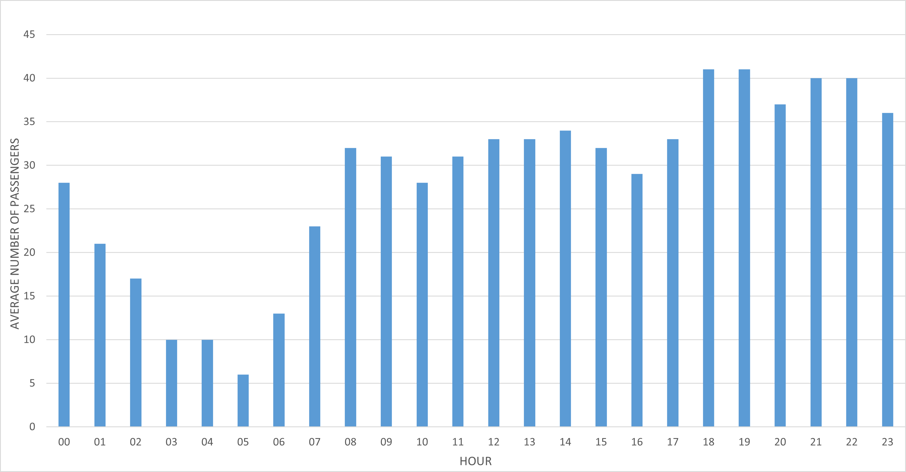

# Taxi_project_626

Q1. What datetime range does your data cover?  How many rows are there total?
 
Ans. For finding the range of the datetime I used the pickup_datetime column.I used try and except on the string to datetime conversion          statement so as to filter out any non-date entry, then checked if the datetime variable is not None. After that, I used the if and elif      statements to find the minimum and maximum values of the column. And I ran all these statements for n>0, as to remove the headers. So,      I found out that this table represents the taxi trips taken in August 2013. By doing the same thing for dropoff_datetime column, I          found out that some dates where from september month,but I did not consider them for maximum values as they were few and understood          that some will be in september as their pickup time was on the night of 31st August. So, I ignored those values, as this file clearly        is for August month. Datetime range is from 2013-08-01 00:00:00 to 2013-08-31 23:59:59.
         For finding the number of rows, I used the if n%1000000==0 statement to see the 1 millionth row getting printed and used the            print(n) statement at the end outside the for loop to print the total number of rows. It was 12597110 
      
      
Q2. What are the field names?  Give descriptions for each field.

Ans. Printed the row in the for loop.Initialised n=0 outside the loop, then broke the loop if n>0. So, only the first row got printed.
     
<br/>
   This the code that I used:
<br/>

```python
for row in reader:
    print(row)
    n+=1
    if n>0:
        break
```     
    
   Field names are- 'medallion', ' hack_license', ' vendor_id', ' rate_code', ' store_and_fwd_flag', ' pickup_datetime',                        'dropoff_datetime', ' passenger_count', ' trip_time_in_secs', ' trip_distance', ' pickup_longitude', ' pickup_latitude',                    'dropoff_longitude', ' dropoff_latitude'.
      
   Descriptions:-
   
   1. medallion- Permit number required to run taxi. They are unique for each taxi.
   
   2. hack_license- License number required to drive a taxi. They are unique for every driver. 
   
   3. vendor_id- A code indicating the TPEP provider that provided the record.
   
   4.  rate_code- This is the rate-code applicable at the end of the trip
   
   5. store_and_fwd_flag- This has 2 values- Yes and No, indicating whether trip record was held in vehicle memory before sending to the           vendor, aka "store and forward", because the vehicle did not have a connection to the server.
   
   6. pickup_datetime- The date and time at which the passengers where picked up by the taxi
   
   7. dropoff_datetime- The date and time at which the passengers where dropped off by the taxi 
   
   8. passenger_count- number of passengers on a taxi trip
   
   9. trip_time_in_secs- Time taken in the trip in seconds
   
   10. trip_distance- The length of the taxi trip in Miles
   
   11. pickup_longitude- The longitude of the location where taxi picked up the passenger
   
   12. pickup_latitude- The latitude of the location where taxi picked up the passenger
   
   13. dropoff_longitude- The longitude of the location where taxi dropped off the passenger
   
   14. dropoff_latitude- The latitude of the location where taxi dropped off the passenger

Q3. Give some sample data for each field.

Ans. Printed 20 sample data using the for loop on reader. Ignored the first row and broke the loop if n>20.
<br>
   This the code that I used:
<br>

```python

for row in reader:
    if n>0:
        print(row)
    n+=1
    if n>20:
        break
```
Q4. What MySQL data types / len would you need to store each of the fields? 
          int(xx), varchar(xx),date,datetime,bool, decimal(m,d)

Ans. medallion- varchar(40)
     hack_license- varchar(40)
     vendor_id- char(3)
     rate_code- int(3)
     store_and_fwd_flag- boolean
     pickup_datetime- datetime
     dropoff_datetime-  datetime
     passenger_count- int(3) (due to the outlier 208)
     trip_time_in_secs- int(7) (due to the outlier 4294966)
     trip_distance- decimal(10,2) (due to the outlier 15331800.00)
     pickup_longitude- decimal(10,6) (due to many outliers)
     pickup_latitude- decimal(10,6) (due to many outliers)
     dropoff_longitude- decimal(10,6) (due to many outliers)
     dropoff_latitude- decimal(10,6) (due to many outliers)
     

Q5. What is the geographic range of your data (min/max - X/Y)?
    Plot this (approximately on a map)

Ans. In order to find geographic range of the data, first I wanted to remove the outliers and values that are too far from NYC and chose          range(37,44) for both latitudes and chose range(-78,-72) for both longitudes. After doing this, I found out the minimum and maximum          values of columns pickup_longitude, pickup_latitude, dropoff_longitude, dropoff_latitude by first converting them into float, so that I      can compare them. In the end, I found the minimum and maximum latitudes by comparing the minimums and maximums from both latitude            columns. And similarly I found the minimum and maximum longitudes. Minimum and Maximum latitudes are 37.030144 and 43.987225                respectively. Minimum and Maximum longitudes are -78.949997 and -73.001663 respectively.
<br>
This is the code I used for pickup_latitude:
<br>
```python
        try:
            latitude1 = float(row[11])
        except:
            continue
        if latitude1 is not None:
            if int(latitude1) in range(37,44):
                latitude1 = float(row[11])
                if n==1:
                    pick_lat_min = latitude1
                    pick_lat_max = latitude1
                elif latitude1 < pick_lat_min:
                        pick_lat_min = latitude1
                elif latitude1 > pick_lat_max:
                        pick_lat_max = latitude1
```

In the 2nd script, I found the corresponding longitudes for minimum and maximum latitude and the corresponding latitudes for minimum and maximum longitude and plotted them on a graph. (X-Lat, Y-Lon)




Q6. What is the average trip distance? (You should use Haversine Distance)? Draw a histogram of the trip distances binned anyway you see         fit. 

Ans. For finding the average trip distance using the Haversine formula, I copied and pasted the haversine function and import statements.
     After that I called the haversine function inside the for loop by passing the parameters as float values and I assigned the distance        value to a variable.Then I calculated the average trip distance by dividing the sum of distances by total number of valid rows. Also, I      took trip distance values that were less than 200 Miles to remove a few outliers as the average trip distance increased significantly        due to them and also because I wanted to capture only those trips that happened in and around NYC. Also, I used >0 condition on trip        distance to capture only valid trips. The average trip distance according to Haversine formula is 3.537499738549388 Miles.
     
<br>
This is the code I used to call the function and calculate the average distance:
<br>

```python
for row in reader:
    if n>0:
        distance = None
        try:
            distance = haversine(float(row[10]),float(row[11]),float(row[12]),float(row[13]))
        except:
            continue
        if distance is not None:
            if distance>0 and distance<200:
                Sum = Sum + distance
                count+=1
    
    n+=1
Average_trip_distance = Sum/count
```
For creating histogram of trip distances, I took 0-1 Miles, 1-2 Miles, 2-3 Miles, 3-4 Miles, 4-5 Miles, Greater than 5 Miles values for the x-axis and their corresponding total number of rows in the y-axis.



Q7. What are the distinct values for each field? (If applicable)

Ans. I calculated distinct values for fields- 'medallion',' hack_license',' vendor_id',' rate_code',' store_and_fwd_flag','passenger_count',      ' trip_time_in_secs' and ' trip_distance'. For varchar and char value fields like 'medallion',' hack_license',' vendor_id' and              'store_and_fwd_flag',I removed the null values. For int and float value columns like ' rate_code','passenger_count',                        'trip_time_in_secs' and ' trip_distance', I check if they can be converted to int or float depending on the column, using try and            except. Then I used dictionary to calculate the distinct values.

<br>
    this is the code that I used to remove null values:
<br>

```python
        if len(medallion)!=0:
            if medallion in shist.keys():
                shist[medallion] += 1
            else:
                shist[medallion] = 1
     
```   

Note- Some codes are not showing output, even though they are correct. Maybe it is my system's problem.


Q8. For other numeric types besides lat and lon, what are the min and max values?

Ans. I calculated the minimum and maximum values of rate_code, passenger_count, trip_distance, trip_time_in_secs. I did not consider the          outliers for passenger_count, trip_distance, trip_time_in_secs. Like explained above, I removed values greater than 200 Miles from trip      distance because I wanted to remove data which is too far from NYC and lower limit was 0.1 Miles to remove 0 and -ve values. For            passenger count, I set the upper limit at 10 to accomodate the cabs that are huge(if possible) and in case some people dropped off in        the middle of the trip and others got in the cab. I set the lower limit at 1 so as to include only the valid trips. For
     trip_time_in_secs, I set the lower limit at 30 secs because I think that will be the time taken to cover the minimum trip distance of        0.1 Miles, particularly in a busy city like New York. Similarly, I set the upper limit at 15000 secs which is a lttle more than 4            hours, as I think that will be approximately the time taken to cover the maximum distance of 200 Miles.
     
   Minimum trip distance- 0.11 Miles and Maximum trip distance is 199.7 Miles
   Minimum rate code is 1 and Maximum rate code is 239
   Minimum passenger count is 1.0 and Maximum passenger count is 9.0
   Minimum trip time is 31.0 seconds and Maximum trip time is 14880.0 seconds


Q9. Create a chart which shows the average number of passengers each hour of the day. (X axis should have 24 hours)

Ans. First I calculated the total number of days across which this data spans. To do that I took the valid pickup_datetime values and split      them to get the date and split them again to get the combination of month and date. Then, I found the uniue month and date values using      dictionary. In the end I calculated the length of dictionary to get the number of days. Number of days are 31.

<br>
  I used this code to get the number of days:
<br>

```python
for row in reader:
    if n>0:
        dts = None
        try:
              dts = row[5].split(" ")[0].split("-")[1:3]
        except:
            continue
        if dts is not None:
            month_day = dts[0]+" "+dts[1]
            if month_day in shist.keys():
                shist[month_day]+=1
            else:
                shist[month_day]=1
                
    n+=1

print(shist)
print("\n",len(shist))  

```

Then in the 2nd script, I double split the valid pickup_datetime values to get the hour value. After that I used dictionary to calculate the total passenger_count for that hour across all the days. And in the end, in another for loop, I divided dictionary values by 31 to get the average number of passengers for each hour of the day.

<br>
    I used below code to perform above mentioned operation:
<br>

```python

for row in reader:
    if n>0:
        hour=None
        try:
            hour = row[5].split(" ")[1].split(":")[0]
        except:
            continue
        if hour is not None:
            if hour in shist.keys():
                shist[hour]+= int(row[7])
            else:
                shist[hour]= int(row[7])
    
    n+=1
    
for hour in shist.keys():
    
   shist[hour]=shist[hour]//Number_days
   
```



Q10. Create a new CSV file which has only one out of every thousand rows.

Ans. To do this, first I created and opened a new subset file in write mode and overwrote everything with ' ', so that I don't have any data      in the file while appending. Then I closed the file  reopened it in the append mode and created a writer variable using csv.writer to        write data to the file. I gave delimiters as ',' and '\n' to recognize new column and new row. Then I wrote every thousandth row on the      new file using modulus. I used if n%1000==0 statement and wrote the entire row if this condition satisfied.


Q11. Repeat step 9 with the reduced dataset and compare the two charts.

Ans. After comparing question 9 chart with new subset chart, I found out that they follow almost the same trend with 19-23 hours having the      most number of passengers and 01-05 hours having the least number of passengers. So, I think  reducing the dataset did not have much        effect because the reduced dataset is also pretty huge, having 12800 rows appromately. So, it is following the same pattern. Maybe          reducing the dataset even more will change the pattern a little bit.



NOTE- I have also uploaded the outlier testing file, in which I tested possible outliers of certain columns.


